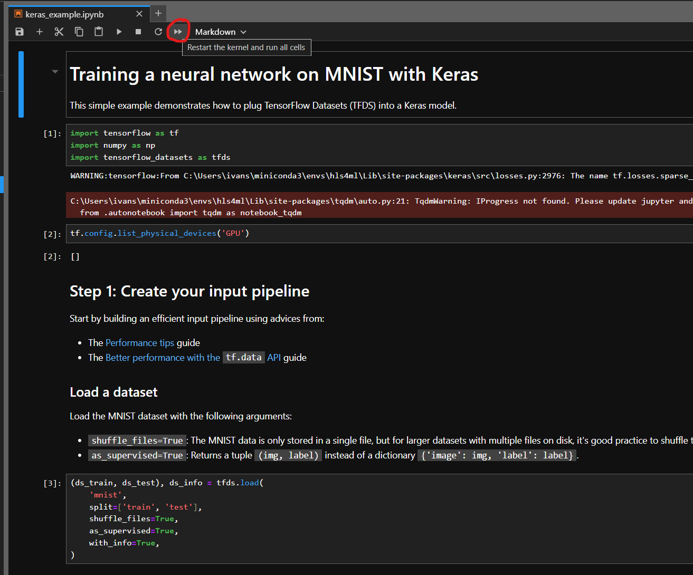

# rust deep learning

## Description

The purpose of this project is to utilize Python's Keras models from Rust for inference. It aims to achieve significantly faster and more efficient processing compared to traditional methods.

### Hihg overview of usage
1. Train and setup model using Python\Keras.
2. Save your model as .keras file
3. Use result model arhitecture and weights from Rust.

Currently, the project has been tested only with CPU execution. As an example, we train the model using the [MNIST dataset](https://www.tensorflow.org/datasets/catalog/mnist). With the provided example, we've observed a remarkable 10x increase in execution speed!

Supported layers:
| Input | Flatten | Dense | Conv2D | MaxPooling2D | Dropout | LSTM  |
|-------|---------|-------|--------|--------------|---------|-------|
|   ✓   |    ✓   |   ✓  |         |               |         |       |

## Installation
To build the script, you need to install the [HDF5 module](https://portal.hdfgroup.org/downloads/). 
> **_NOTE:_** Currently, the Rust HDF5 module only supports versions 8, 10, and 12. I tested with version 12.

Add the `HDF5_DIR` to the installed directory so that the module knows where to find the binaries. All other modules can be obtained fully through Cargo.

## Running the Example

To run the example and obtain the model, follow these steps:

1. Run [keras_example.ipynb](keras_example.ipynb).
    - If you're not familiar with Python, follow these instructions:
        1. Install [TensorFlow](https://www.tensorflow.org/install/pip).
        2. Run the following command:
            ```
            pip install jupyterlab tensorflow_datasets
            ```
        3. Open Jupyter Notebook from the current folder:
            ```
            cd /path/to/current/dir
            jupyter lab
            ```
        4. Run the following command to execute all cells and obtain the result.
        
    - Alternatively, interact with the notebook as desired.

2. After running the notebook, you will have a `model.keras` file, which is a zip archive. 
    - **Note:** The crate currently does NOT support zip extraction, so please extract the files manually to the same folder. You will obtain the required files for this example:
        - `model.weights.h5`: Contains all the weights.
        - `config.json`: Contains module configuration.
        - `test_data.npz`: Archive with test examples used for testing.

3. At the current stage, only the `Sequential` model is supported.

4. Run the module:
    ```
    cargo run
    ```

License
This project is licensed under the MIT License.

Acknowledgements
Special thanks to the contributors and supporters of the project for their valuable input and feedback.